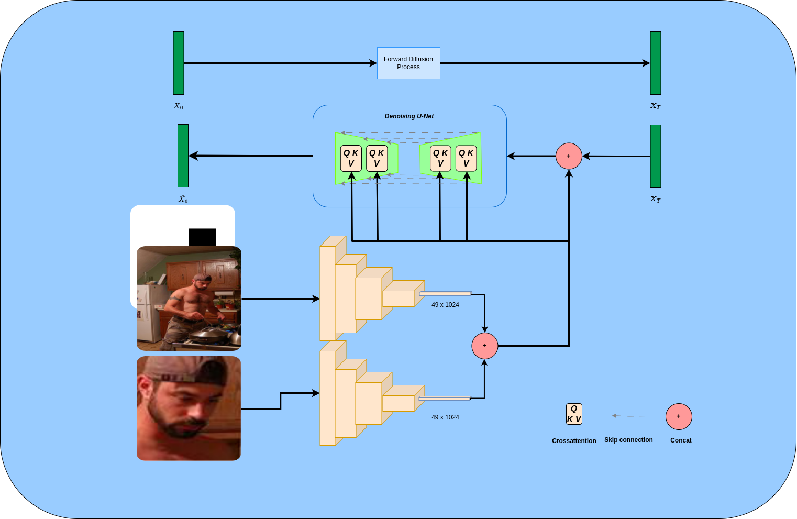

# Diffusion Gaze Following Model

This is a Gaze Following model based on diffusion models

## Notes for modifications

* In the main function in line 86 you will find a function called `get_model`, it controls the trainable model. Open file `build.py` under the models folder and you will find `gaze_model` under the `get_model` function and this is mainly a model containing the 2 resnets and returns to me 2 things:
  * conditioning: this will differ from one architecture to another.
  * scene_face_feat: for the bce loss to predict inside outside the scene value, you need to concat the scene and the face features outputted from the 2 resent to have an output of size (7,7,2048) which get fed to sequential network to output the in/out scene label predicted.
* This `gaze_model` should be changeable from architecture to the other as long as the model returns both a conditioning and scene_face_feat
* Use `config.unet_context_vector` to control the size of the context vector for the cross attention
* if you are freezing something, check the part in the function of `get_model`to control what part of the model to freeze
* When loading pretrained function, for the model that I am using I had to rename the some stuff in the init weights so that it fits and works properly, this part will need to be configurable from one model to another.
* The `optimizer.py` i am diviiding my model into 2 parts  a part with diffusion and part with gaze, so make sure whatever you do, always make sure that the lr is fixed. Check how it is implemented because it is really important, you will recogonize that it will make problems for you. It will need to be changed.
* I looked through out the full code to think if there are interconnected parts but I couldn't find. Let mdife know how it goes

## Command to run the code

* If you donot call `--is_subsample_test_set`  this means that you are sampling 10% of evaluation set. If you call it, then you are **not** sampling the test set for the gazefollowing
* To run a command without BCE loss and on the inside gaze data-set with full evaluation on test set

```
python3 main.py --yaml_diffusion diffusion.yaml --yaml_gaze gaze.yaml --tag trial_gaze
```

****

This is not used anymore

```
python3 main.py --init_weights pretrained/init_weights.pt --watch_wandb --tag example_1 --adm_predict_xstart --diff_normalization 0.1 --norm_std_flag --random_flag --epochs 30 --lr_schedular --source_dataset_dir datasets/gazefollow_extended --source_dataset gazefollow --is_subsample_test_set --amp O1
```

* To run a command with the BCE loss and on the full training data-set with full evaluation on test set

```
python3 main.py --init_weights pretrained/init_weights.pt --watch_wandb --tag example_1 --adm_predict_xstart --diff_normalization 0.1 --norm_std_flag --random_flag --epochs 30 --lr_schedular --source_dataset_dir datasets/gazefollow_extended --source_dataset gazefollow --x_loss --is_subsample_test_set --amp O1
```

## Requirements

* Install  Python 3.10.11

```
sudo apt install software-properties-common -y
sudo add-apt-repository ppa:deadsnakes/ppa
sudo apt install python3.10
```

* install virtual env

  ```
  python3.10-m pip install --user virtualenv
  python3 -m venv thesis_env
  ```
* Activate the enviroment using `source thesis_env\bin\activate` and install the requirements commands

```
pip install -r requirements.txt
```

* Remember to install apex using the following [link](https://github.com/NVIDIA/apex)

## Train and evaluate

Before training, download the pretraining weights [here](https://www.dropbox.com/s/l3xo4h7nghef3m5/init_weights.pt?dl=0).
The script allows to train and evaluate different datasets.
To evaluate only, set the ‵eval_weights‵ variable.

```python3
usage: main.py [-h] [--tag TAG] [--device {cpu,cuda,mps}]
               [--input_size INPUT_SIZE] [--output_size OUTPUT_SIZE]
               [--batch_size BATCH_SIZE]
               [--source_dataset_dir SOURCE_DATASET_DIR]
               [--source_dataset {gazefollow,videoattentiontarget,goo}]
               [--num_workers NUM_WORKERS]
               [--gaze_point_threshold GAZE_POINT_THRESHOLD]
               [--init_weights INIT_WEIGHTS] [--eval_weights EVAL_WEIGHTS]
               [--list_resnet_scene_layers [LIST_RESNET_SCENE_LAYERS ...]]
               [--list_resnet_face_layers [LIST_RESNET_FACE_LAYERS ...]]
               [--resnet_scene_inplanes RESNET_SCENE_INPLANES]
               [--resnet_face_inplanes RESNET_FACE_INPLANES]
               [--unet_inout_channels UNET_INOUT_CHANNELS]
               [--unet_inplanes UNET_INPLANES] [--unet_residual UNET_RESIDUAL]
               [--list_unet_inplanes_multipliers [LIST_UNET_INPLANES_MULTIPLIERS ...]]
               [--list_unet_attention_levels [LIST_UNET_ATTENTION_LEVELS ...]]
               [--unet_spatial_tf_heads UNET_SPATIAL_TF_HEADS]
               [--unet_spatial_tf_layers UNET_SPATIAL_TF_LAYERS]
               [--unet_context_vector UNET_CONTEXT_VECTOR]
               [--is_subsample_test_set] [--Debugging_maps] [--watch_wandb]
               [--diff_normalization DIFF_NORMALIZATION] [--norm_std_flag]
               [--predict_sthg {pred_noise,pred_x0}] [--attention_layout]
               [--random_flag] [--train_time_steps TRAIN_TIME_STEPS]
               [--sample_time_steps SAMPLE_TIME_STEPS]
               [--unet_dropout UNET_DROPOUT]
               [--offset_noise_strength OFFSET_NOISE_STRENGTH]
               [--noise_changer] [--mse_loss_weight_type MSE_LOSS_WEIGHT_TYPE]
               [--adm] [--adm_use_kl] [--adm_predict_xstart] [--adm_predict_v]
               [--lr_schedular] [--fix_snr] [--adm_rescale_timesteps]
               [--adm_rescale_learned_sigmas] [--adm_learn_sigma]
               [--clip_denoised] [--adm_attention_module]
               [--eval_from_picture] [--time_noise TIME_NOISE] [--kl_div_loss]
               [--x_loss] [--other_loss] [--lr LR] [--epochs EPOCHS]
               [--evaluate_every EVALUATE_EVERY] [--save_every SAVE_EVERY]
               [--print_every PRINT_EVERY] [--no_resume]
               [--output_dir OUTPUT_DIR] [--amp AMP] [--channels_last]
               [--freeze_scene] [--freeze_face] [--ema_on]
               [--ema_rate EMA_RATE] [--lr_anneal_steps LR_ANNEAL_STEPS]
               [--weight_decay WEIGHT_DECAY] [--no_wandb] [--no_save]

options:
  -h, --help            show this help message and exit
  --tag TAG             Description of this run
  --device {cpu,cuda,mps}
  --input_size INPUT_SIZE
                        input size
  --output_size OUTPUT_SIZE
                        output size
  --batch_size BATCH_SIZE
                        batch size
  --source_dataset_dir SOURCE_DATASET_DIR
                        directory where the source dataset is located
  --source_dataset {gazefollow,videoattentiontarget,goo}
  --num_workers NUM_WORKERS
  --gaze_point_threshold GAZE_POINT_THRESHOLD
  --init_weights INIT_WEIGHTS
                        initial weights
  --eval_weights EVAL_WEIGHTS
                        If set, performs evaluation only
  --list_resnet_scene_layers [LIST_RESNET_SCENE_LAYERS ...]
                        Please enter a list for the resnet scene layers
  --list_resnet_face_layers [LIST_RESNET_FACE_LAYERS ...]
                        Please enter a list for the resnet face layers
  --resnet_scene_inplanes RESNET_SCENE_INPLANES
                        Resnet scene inplanes
  --resnet_face_inplanes RESNET_FACE_INPLANES
                        Resnet face inplanes
  --unet_inout_channels UNET_INOUT_CHANNELS
                        Unet input output channels
  --unet_inplanes UNET_INPLANES
                        Unet inplanes
  --unet_residual UNET_RESIDUAL
                        Unet reisdual connections blocks
  --list_unet_inplanes_multipliers [LIST_UNET_INPLANES_MULTIPLIERS ...]
                        Please enter a list for the inplanes multipliers for
                        unet
  --list_unet_attention_levels [LIST_UNET_ATTENTION_LEVELS ...]
                        Please enter a list for the attention levels for unet
  --unet_spatial_tf_heads UNET_SPATIAL_TF_HEADS
                        number of transfoermer heads
  --unet_spatial_tf_layers UNET_SPATIAL_TF_LAYERS
                        number of transformers
  --unet_context_vector UNET_CONTEXT_VECTOR
                        Unet context vector of spefic size
  --is_subsample_test_set
                        This flag is used to subsample the test set, set it to
                        false so that you have access to the full test set
  --Debugging_maps      This flag is used to output maps during training as
                        figures
  --watch_wandb         This flag is used to turn on the wandb watching
                        feature
  --diff_normalization DIFF_NORMALIZATION
                        This is used to control the normalizaiton range of the
                        diffusion model
  --norm_std_flag       This flag is used to turn on the std during
                        normalization
  --predict_sthg {pred_noise,pred_x0}
  --attention_layout    This flag will switch into a different design for the
                        resnets including the enocder
  --random_flag         This flag is used to make the heatmaps have different
                        radius or even higher values
  --train_time_steps TRAIN_TIME_STEPS
                        time steps for trainng the diffusion model
  --sample_time_steps SAMPLE_TIME_STEPS
                        time steps for evaluating the diffusion model
  --unet_dropout UNET_DROPOUT
                        This is used to control the drop of the unet
  --offset_noise_strength OFFSET_NOISE_STRENGTH
                        This is used to control the drop of the unet
  --noise_changer       This is the noise that we change the noise
  --mse_loss_weight_type MSE_LOSS_WEIGHT_TYPE
  --adm                 This is flag to swtich to the formulation and Unet of
                        ADM model
  --adm_use_kl          This is flag to swtich to the formulation and Unet of
                        ADM model
  --adm_predict_xstart  This is flag to swtich to the formulation and Unet of
                        ADM model
  --adm_predict_v       This is flag to swtich to the formulation v
  --lr_schedular        This is flag to swtich to the lrschedular
  --fix_snr             this is used to fix the SNR ratio of the model
  --adm_rescale_timesteps
                        This is flag to swtich to the formulation and Unet of
                        ADM model
  --adm_rescale_learned_sigmas
                        This is flag to swtich to the formulation and Unet of
                        ADM model
  --adm_learn_sigma     This is flag to swtich to the formulation and Unet of
                        ADM model
  --clip_denoised       This is flag to clip denosied of the model
  --adm_attention_module
                        THis flag is used to change the attention to different
                        path
  --eval_from_picture   When set to true , you are not starting from noise
  --time_noise TIME_NOISE
                        You noise till certain point .
  --kl_div_loss         This is used to try to run KL divergence loss to turn
                        it on
  --x_loss              This is used to try to turn on the classes losse
  --other_loss          THis flag is used activate another part of the loss
                        that I am not sure if it is useful or not
  --lr LR               learning rate
  --epochs EPOCHS       number of epochs
  --evaluate_every EVALUATE_EVERY
                        evaluate every N epochs
  --save_every SAVE_EVERY
                        save model every N epochs
  --print_every PRINT_EVERY
                        print training stats every N batches
  --no_resume           Resume from a stopped run if exists
  --output_dir OUTPUT_DIR
                        Path to output folder
  --amp AMP             AMP optimization level
  --channels_last
  --freeze_scene        Freeze the scene backbone
  --freeze_face         Freeze the head backbone
  --ema_on              Work with the EMA weights
  --ema_rate EMA_RATE   the ema rate value that you choose in here.
  --lr_anneal_steps LR_ANNEAL_STEPS
                        the learning rate anenel steps
  --weight_decay WEIGHT_DECAY
                        the weighting decay value
  --no_wandb            Disables wandb
  --no_save             Do not save checkpoint every {save_every}. Stores last
                        checkpoint only to allow resuming

```
