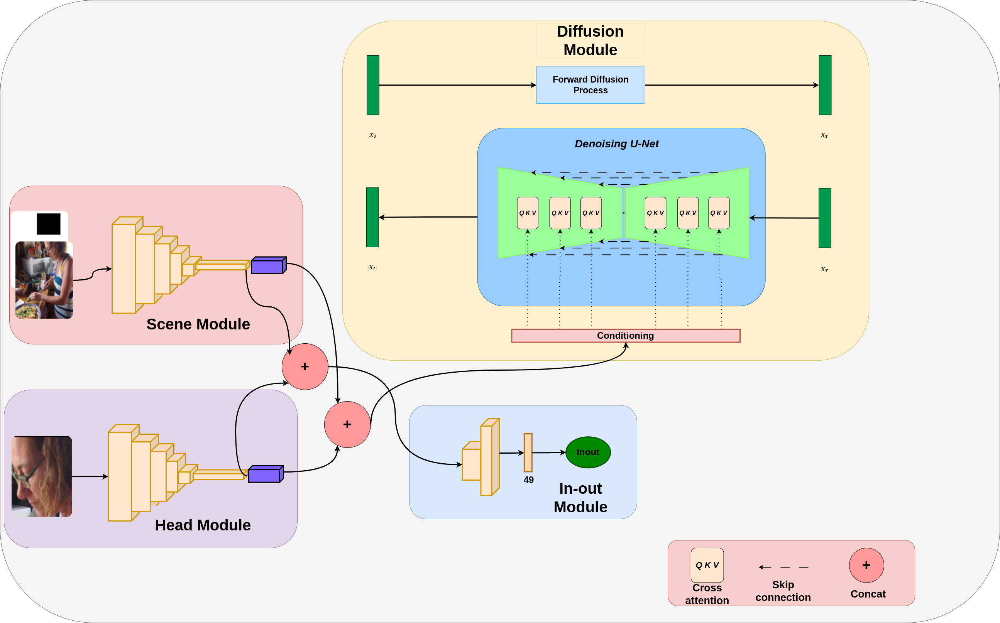

# Diffusion Gaze Following Model

This is a Gaze Following model based on diffusion models

This part of my master thesis titled : **DIFFUSIONGAZE: DIFFUSION MODEL BOOSTED GAZE TARGET DETECTION**



## Requirements

### Environment

To run this repo create a new conda environment and configure all environmental variables using the provided templates.

```bash
conda env create -f requirements.yml
cp .env.example .env
nano .env
git clone https://github.com/NVIDIA/apex
cd apex
pip install -v --disable-pip-version-check --no-cache-dir --no-build-isolation --config-settings "--build-option=--cpp_ext" --config-settings "--build-option=--cuda_ext" ./
```

Due to the complexity of the network use a recent NVidia GPU with at least 8GB of memory available and CUDA 11.3+ installed. Also, we suggest running everything on a Linux-based OS, preferably Ubuntu 20.04.

### Datasets

This network was trained and evaluated on three popular datasets: GazeFollow (extended), VideoAttentionTarget,  We further extended each sample with depth data. You can download the preprocessed datasets with depth [here](https://www.dropbox.com/sh/8o3h1gp6ufgotr3/AACWT7DnXRG8NlzxvqNe3UB5a?dl=1).

### Train and evaluate

Before training, download the pretraining weights [here](https://www.dropbox.com/s/l3xo4h7nghef3m5/init_weights.pt?dl=0).
The script allows to train and evaluate different datasets.
To evaluate only, set the ‵eval_weights‵ variable.

To run the code, one has to run the following command

```bash
python3 main.py --yaml_diffusion diffusion.yaml  --yaml_gaze gaze.yaml --tag name_run
```

Where `diffusion.yaml` and `gaze.yaml` are both configuration files that are used to configure the diffusion model hyper parameters and the gaze networks.
